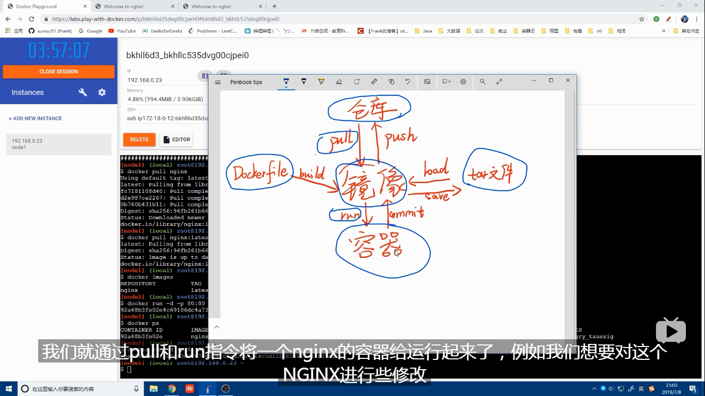

docker 

1. 拉取镜像  

   `docker pull nginx` 默认等同于拉取最新的镜像

   `docker pull nginx:latest`

2. 查看已经有的镜像

   `docker images`

3. 启动一个已有的镜像

   ` docker run -d -p 80:80 nginx`

   这个代表着将docker中nginx 从后台启动服务， 将内部的80 端口映射出来

   -d 参数代表着后台启动服务

   -p 代表着端口映射   外部端口：内部端口

4. 查看已经启动的镜像有哪些

   `docker ps`  可以查看启动了哪些镜像服务

`docker run -d -p 88:80 nginx 
697fbd93aaf79f0c31958563bc872a41565b61103a935bc7cf1485dce39476d2`

5. 进入具体某个镜像内

   `docker exec -it 697f bash `

   表示通过bash切换进入镜像id 为697f 的镜像内部，将打开一个小型的linux 

6. 默认的nginx 的index.html文件在 

   ` cd /usr/share/nginx/html`

7. 退出docker 镜像的容器

   `exit`	

8. `docker ps` 查看目前启动的镜像服务，

9. `docker rm -f 697f`  删除一个启动的镜像服务

10. 创建一个修改后的镜像

    `docker commit 697f my_nginx`

    commit 一个自己修改后的镜像，命名为my_nginx

    通过` docker images` 可以看到效果

11. `docker run -d -p 999:80 my_nginx`  启动一个自己修改后提交生成的镜像

12. `Dockerfile`

    ```docker
     FROM nginx
    
    ADD . /usr/share/nginx/html/
    
    ```

    echo "hello  my docker " > index.html

13. `docker build -t my_nginx .`      将当前文件夹修改后的文件映射到my_nginx 镜像中

14. `docker ps `  查看结果

15. 

